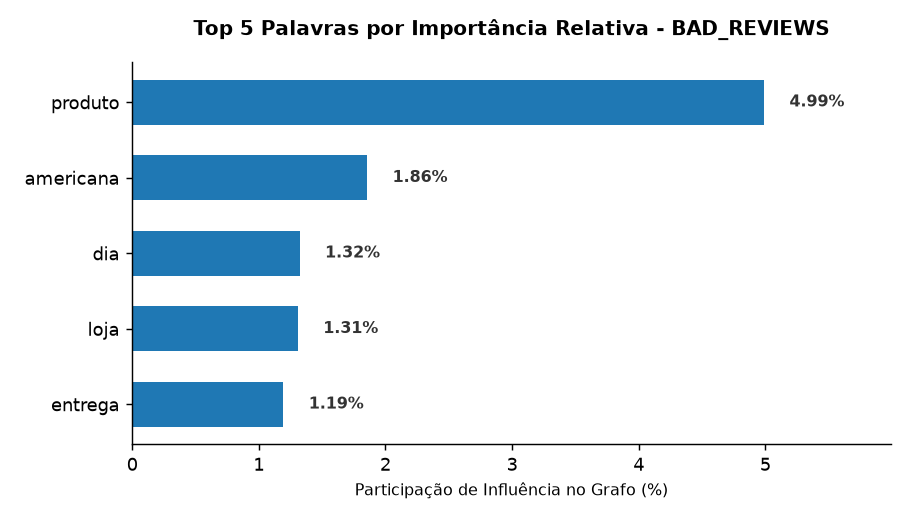
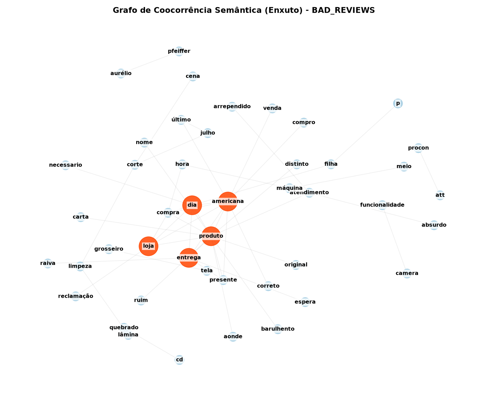
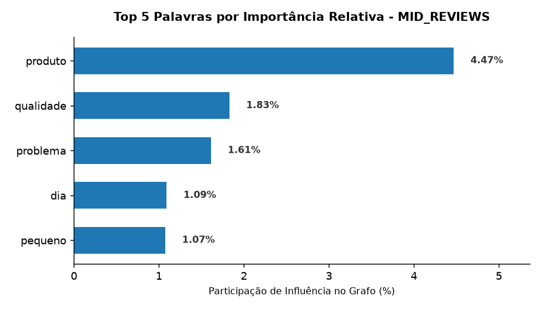
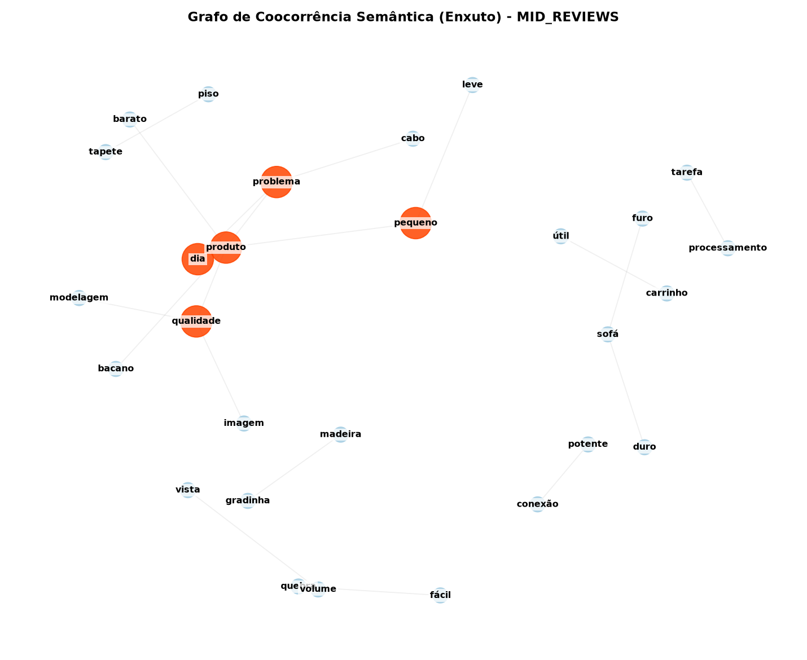
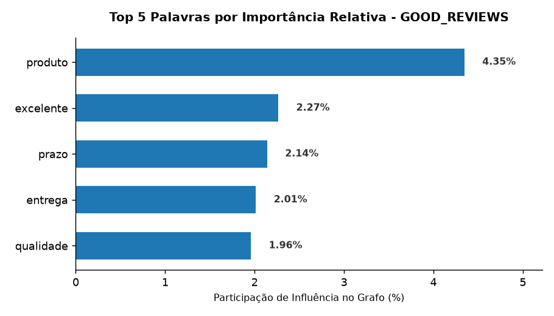
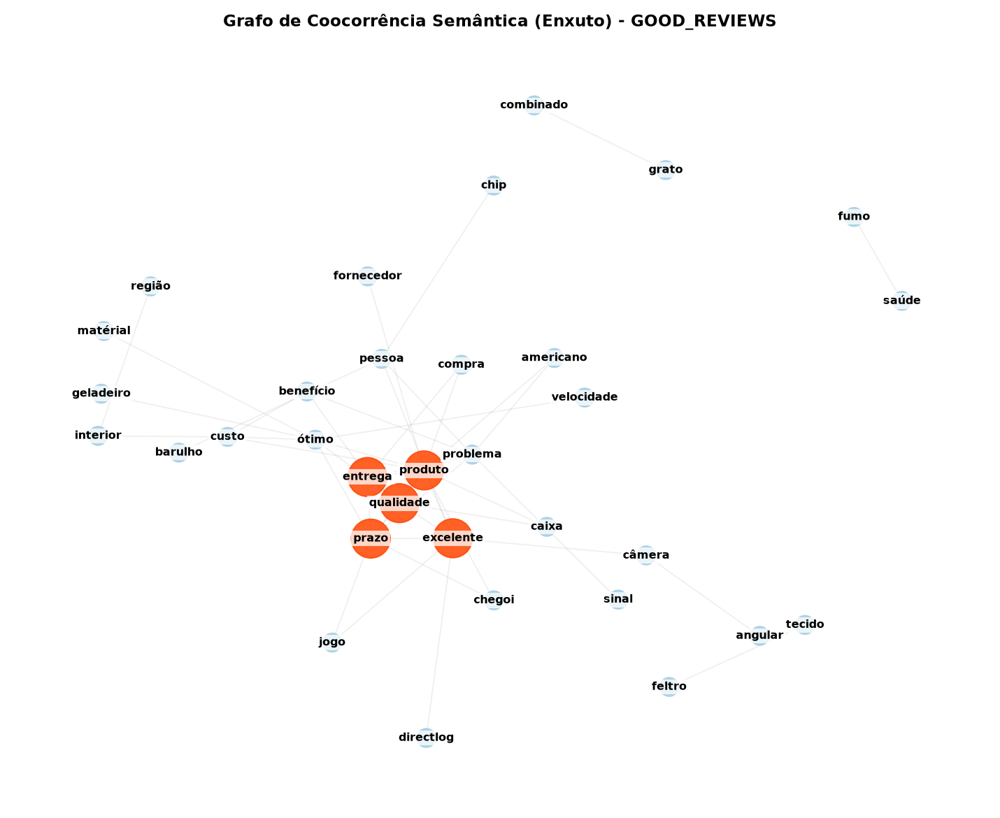

# Relatório Executivo - Amostragem Célula (100 Reviews)
Resultados calculados sobre uma janela restrita de amostragem automática.

---

## 📈 Categoria Estrutural: `BAD_REVIEWS`
* **Principais Hubs (Top PageRank):** produto, americana, dia, loja, entrega

#### Análise Estatística e Topologia da Rede:
<table>
  <tr>
    <td></td>
    <td></td>
  </tr>
</table>

---

## 📈 Categoria Estrutural: `MID_REVIEWS`
* **Principais Hubs (Top PageRank):** produto, qualidade, problema, dia, pequeno

#### Análise Estatística e Topologia da Rede:
<table>
  <tr>
    <td></td>
    <td></td>
  </tr>
</table>

---

## 📈 Categoria Estrutural: `GOOD_REVIEWS`
* **Principais Hubs (Top PageRank):** produto, excelente, prazo, entrega, qualidade

#### Análise Estatística e Topologia da Rede:
<table>
  <tr>
    <td></td>
    <td></td>
  </tr>
</table>

---
