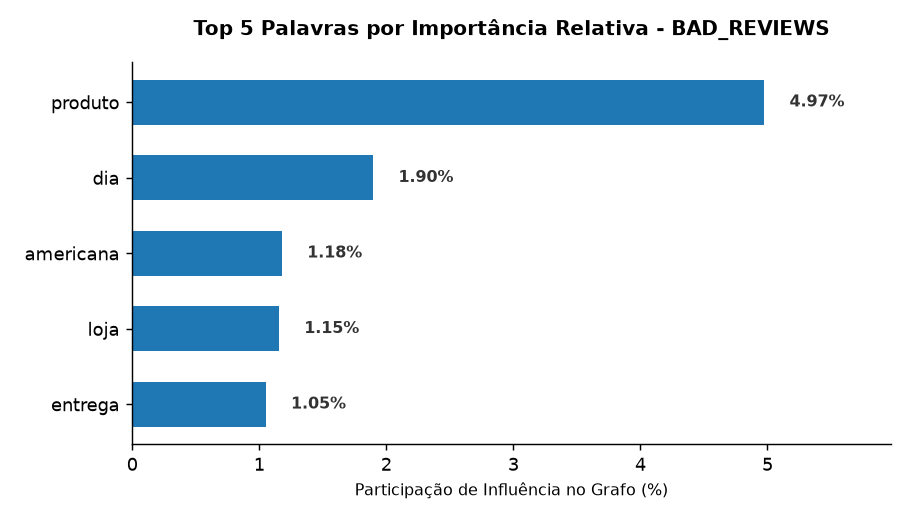
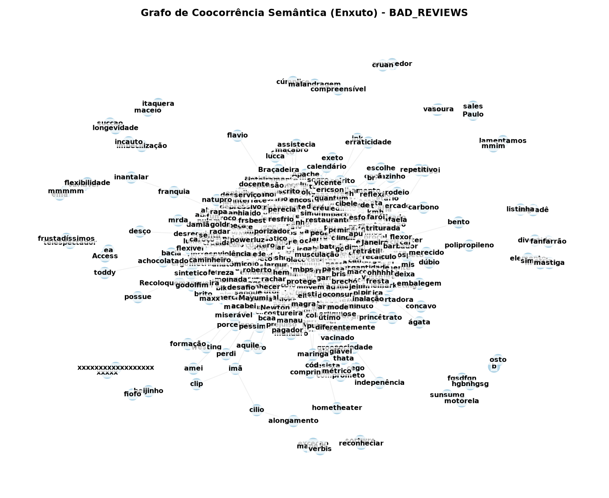
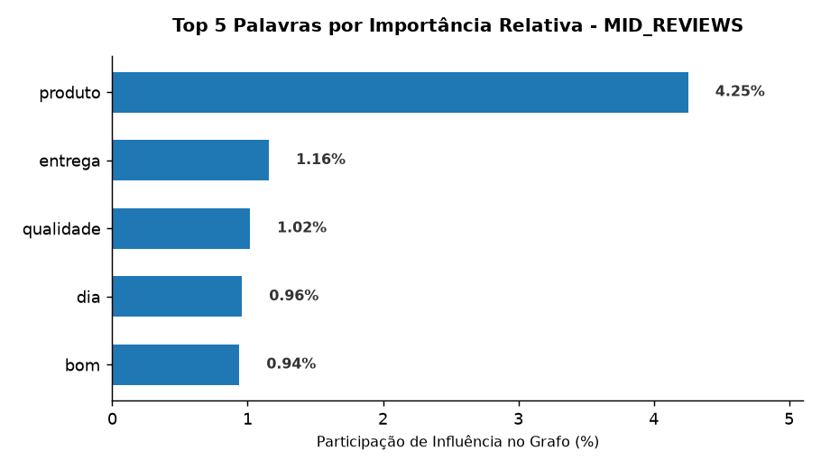
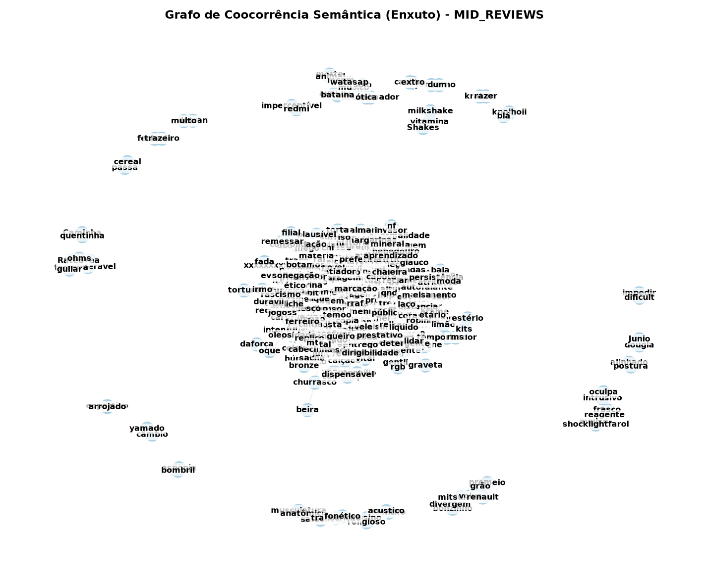
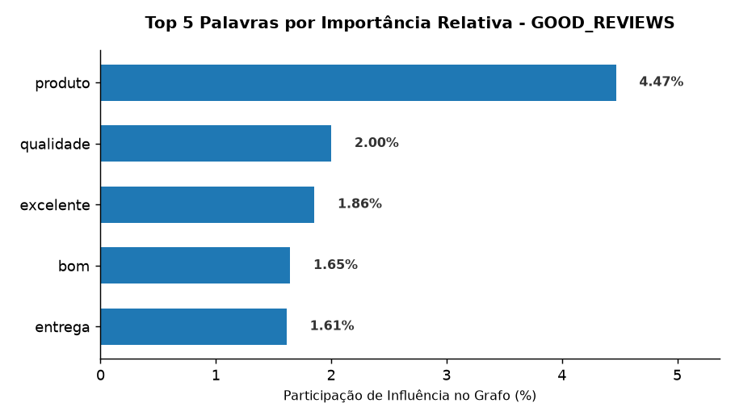
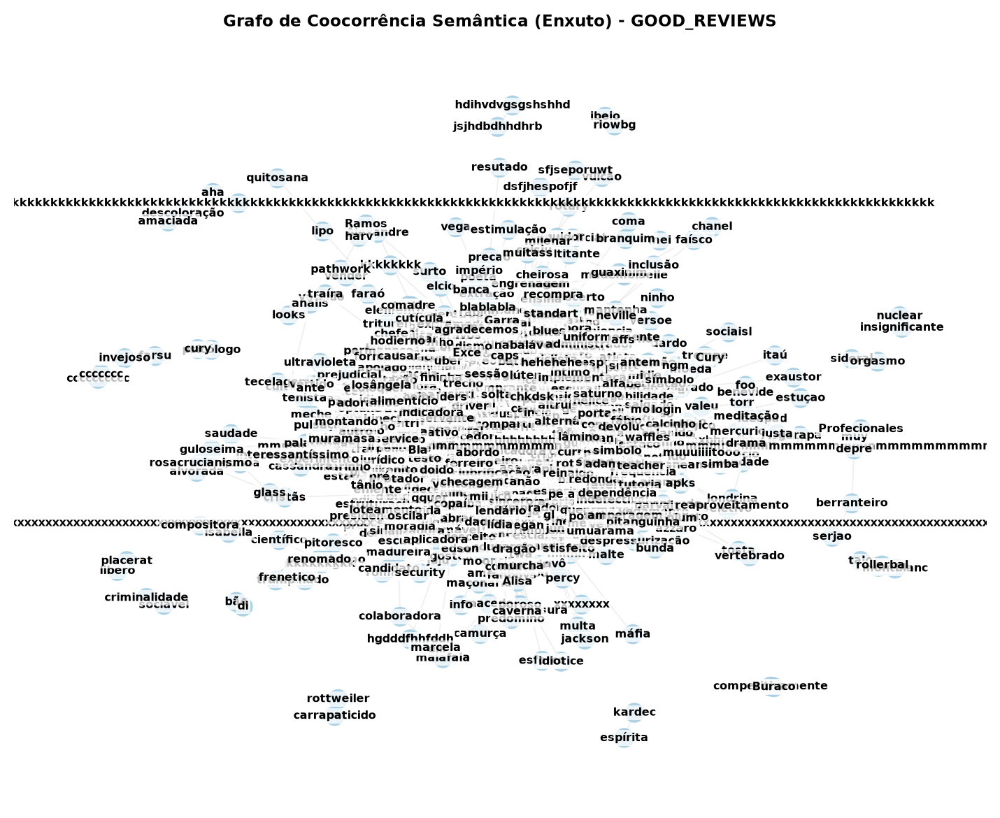

# Relatório Executivo - Escopo Total do Dataset
Resultados consolidados considerando 100% das reviews tratadas pela pipeline.

---

## 📈 Categoria Estrutural: `BAD_REVIEWS`
* **Principais Hubs (Top PageRank):** produto, dia, americana, loja, entrega

#### Análise Estatística e Topologia da Rede:
<table>
  <tr>
    <td></td>
    <td></td>
  </tr>
</table>

---

## 📈 Categoria Estrutural: `MID_REVIEWS`
* **Principais Hubs (Top PageRank):** produto, entrega, qualidade, dia, bom

#### Análise Estatística e Topologia da Rede:
<table>
  <tr>
    <td></td>
    <td></td>
  </tr>
</table>

---

## 📈 Categoria Estrutural: `GOOD_REVIEWS`
* **Principais Hubs (Top PageRank):** produto, qualidade, excelente, bom, entrega

#### Análise Estatística e Topologia da Rede:
<table>
  <tr>
    <td></td>
    <td></td>
  </tr>
</table>

---
